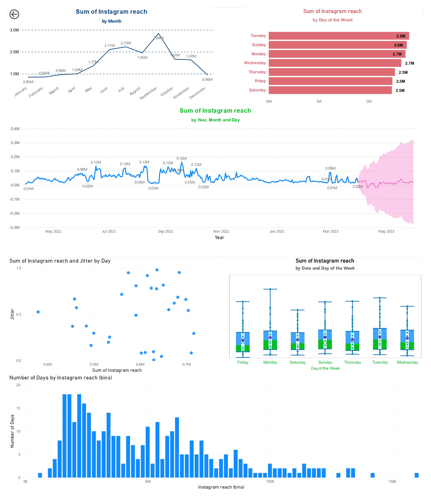

# Instagram Reach Forecasting

Not everyone is always available on social media all the time. 
Some people limit the use of social media during festive seasons, while some avoid social media during their examinations. 
So, as Content creators, we need to decide when to make the most valuable piece of content and when not. 
That is where Instagram Reach Forecasting can help content creators and everyone who uses Instagram professionally.

Instagram reach forecasting is the process of predicting the number of people that an Instagram post, story, or other content will be reached, based on historical data and various other factors.
For content creators and anyone using Instagram professionally, predicting the reach can be valuable for planning and optimizing their social media strategy. 
By understanding how their content is performing, creators can make informed decisions about when to publish, what types of content to create, and how to engage their audience. 
It can lead to increased engagement, better performance metrics, and ultimately, greater success on the platform.

### Technologies used
* - Anaconda
* - Jupyter Notebooks

